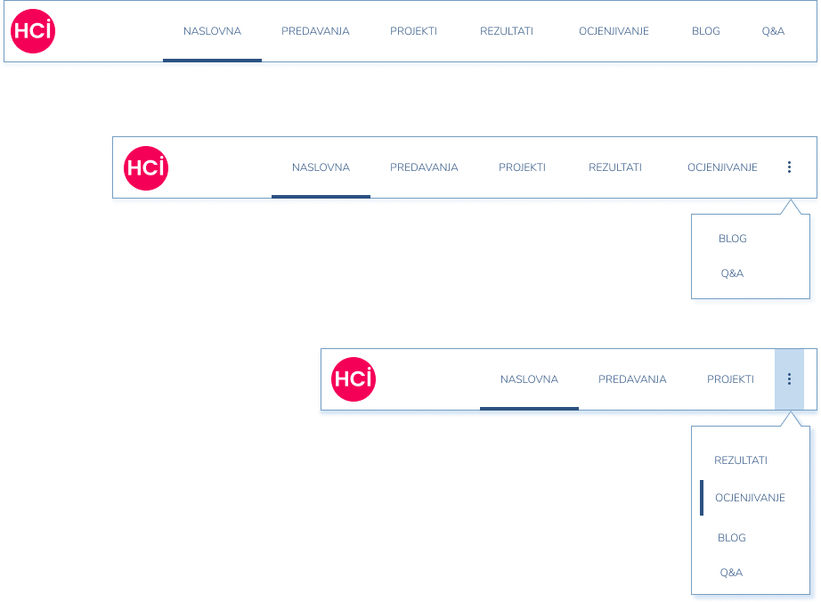
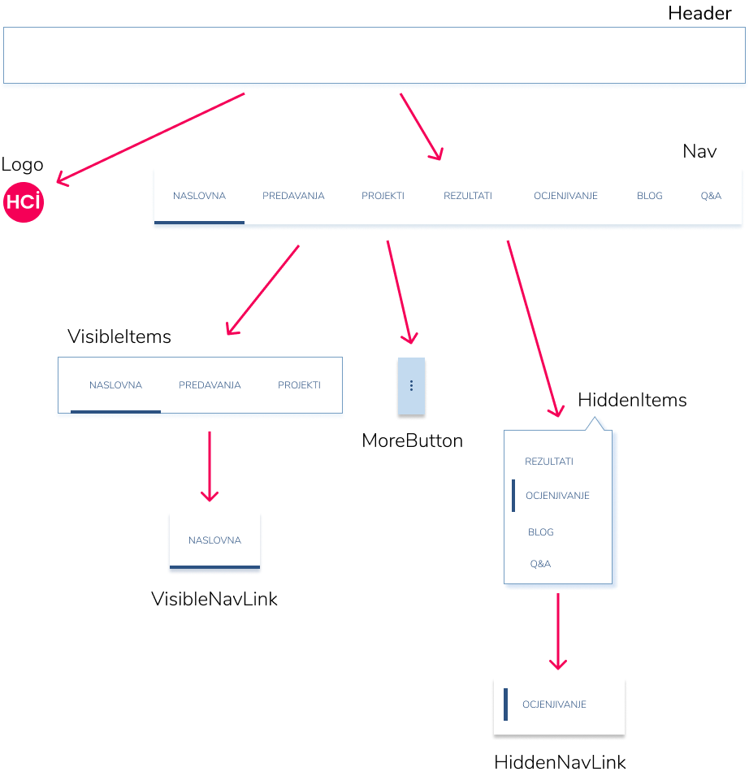

# React Crash Course <!-- omit in toc -->

## Hello World

[reactjs.org: Hello World](https://reactjs.org/docs/hello-world.html)

```jsx
ReactDOM.render(
  <h1>Hello, world!</h1>,
  document.getElementById('container')
);
```

## Imperative vs declarative programming

> _React_ koristi paradigmu **_deklarativnog programiranja_**.

Kod deklarativnog programiranja izražavamo **_što_** želimo vidjeti kao konačan rezultat, za razliku od **_imperativnog programiranja_** gdje kažemo i **_kako_** ostvariti konačan rezultat.

[IanMundy: Declarative vs Imperative Programming](https://codeburst.io/declarative-vs-imperative-programming-a8a7c93d9ad2)

```javascript
// Imperative programming
const container = document.getElementById('container');
const btn = document.createElement('button');
btn.className = 'btn red';

btn.onclick = function(event) {
    if (this.classList.contains('red')) {
        this.classList.remove('red');
        this.classList.add('blue');
    } else {
        this.classList.remove('blue');
        this.classList.add('red');
    }
};

container.appendChild(btn);
```

```jsx
// Declarative programming (React)
const Button = () => {
    const [color, setColor] = useState('red');
    const handleClick = () => setColor(color === 'red' ? 'blue' : 'red');

    return (
        <button
            className={`btn ${color}`}
            onClick={handleClick}
        >
            Change color
        </button>
    )
}
```

Primjetite, kod deklarativnog programiranja (_React_) ne manipuliramo izravno _HTML DOM_-om, odnosno ne diramo izravno HTML element `button` iz DOM-a. Umjesto direktne intervencije u HTML DOM, u _React_-u jednostavno deklariramo element koji se treba prikazati; _React_ se zatim "brine" o tome kako deklarirani element _**optimalno**_ dodati i/ili modificirati u HTML DOM-u.

> Kod _React_- naglasak stavljamo na to **_kako neka komponenta treba izgledati_** a manji na tome kako to postići.

## JSX

> JSX stands for JavaScript XML.

[reactjs.org: Introducing JSX](https://reactjs.org/docs/introducing-jsx.html)

```jsx
const element = <h1>Hello, world!</h1>
```

Iako tag `<h1>` u primjeru podsjeća na HTML tag, on to nije. Radi se o JSX sintaksi. JSX u _React_-u značajno olakšava deklariranje/opis _user interface_-a (_UI-a_).

```jsx
// JSX
const element = (
  <h1 className="greeting">
    Hello, world!
  </h1>
);

// No JSX
const element = React.createElement(
  'h1',
  {className: 'greeting'},
  'Hello, world!'
);
```

## TBA...

## Example: Responsive Navigation Menu

<!-- markdownlint-disable MD033 -->
<p align="center">
    
    <br><br>
    <em>What are we building?</em>
</p>
<!-- markdownlint-disable MD033 -->

#### Planning React components (**_parent-child_** relationship)

<!-- markdownlint-disable MD033 -->
<p align="center">
    
    <br><br>
    <em>Planning React components</em>
</p>
<!-- markdownlint-disable MD033 -->

Kod koji implementira prikazanu navigacijsku traku dostupan je u direktoriju [teaching-hci](teaching-hci/). Koraci za pokretanje koda:

1. Klonirajte HCI-2019-20 repozitorij.
2. U direktoriju `bits-of-javascript-react/react-crash-course/teaching-hci`, u kojem se nalazi datoteka `package.json` izvršite sljedeću naredbu:
   
   ```cmd
   npm install
   ```

3. Konačno, pokrenite razvojni server:
   
   ```cmd
   gatsby develop
   ```

   Alternativno:
   ```cmd
   npm run develop
   ```

